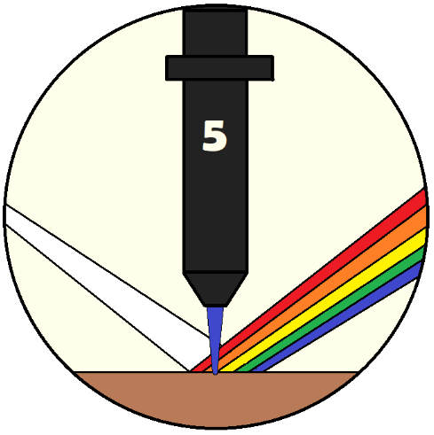

# APALES (Automated Parameter Adjusting Laser Engraving System)

## UCF Senior Design 2 Spring 2024  

Python program split into three major parts:
* Spectroscopy and Classification Algorithm
* Parameterisation of G-code: PWM (Spindle Speed) and Feed Rate
* pySerial G-code sender
